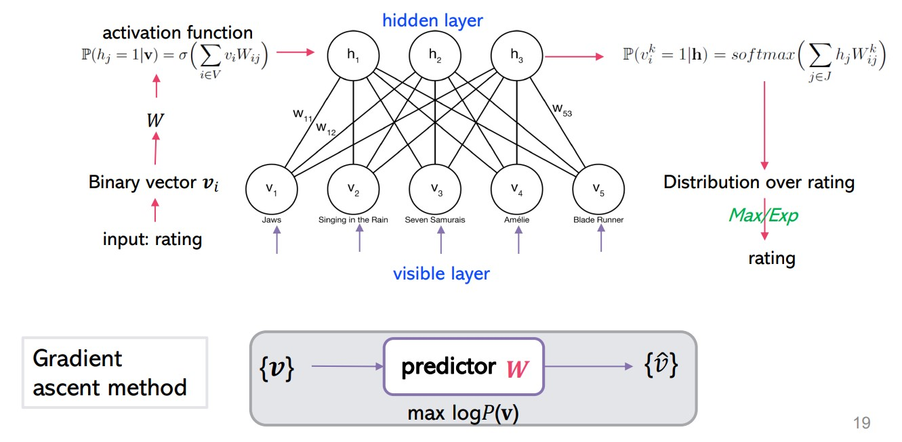

Movie Recommender App
==============================
This project was undertaken as part of the course **DDA4260: Networked Life** during Term 2, 2022/2023 Academic Year at The Chinese University of Hong Kong, Shenzhen (CUHK-SZ).

## Team Members
| Student ID | Student Name   | Email                        
| :----------: | :--------------: | :------------------------------: | 
| 120040022  | Darren Boesono        | 120040022@link.cuhk.edu.cn     | 
| 120040002  | Joseph Ariel Christopher Teja          | 120040002@link.cuhk.edu.cn     | 

## Project Organization

    ├── LICENSE
    ├── Makefile           <- Makefile with commands like `make data` or `make train`
    ├── README.md          <- The top-level README for developers using this project.
    ├── data
    │   ├── external       <- Data from third party sources.
    │   ├── interim        <- Intermediate data that has been transformed.
    │   ├── processed      <- The final, canonical data sets for modeling.
    │   └── raw            <- The original, immutable data dump.
    │
    ├── docs               <- A default Sphinx project; see sphinx-doc.org for details
    │
    ├── models             <- Trained and serialized models, model predictions, or model summaries
    │
    ├── notebooks          <- Jupyter notebooks. Naming convention is a number (for ordering),
    │                         the creator's initials, and a short `-` delimited description, e.g.
    │                         `1.0-jqp-initial-data-exploration`.
    │
    ├── references         <- Data dictionaries, manuals, and all other explanatory materials.
    │
    ├── reports            <- Generated analysis as HTML, PDF, LaTeX, etc.
    │   └── figures        <- Generated graphics and figures to be used in reporting
    │
    ├── requirements.txt   <- The requirements file for reproducing the analysis environment, e.g.
    │                         generated with `pip freeze > requirements.txt`
    │
    ├── setup.py           <- makes project pip installable (pip install -e .) so src can be imported
    ├── src                <- Source code for use in this project.
    │   ├── __init__.py    <- Makes src a Python module
    │   │
    │   ├── data           <- Scripts to download or generate data
    │   │   └── make_dataset.py
    │   │
    │   ├── features       <- Scripts to turn raw data into features for modeling
    │   │   └── build_features.py
    │   │
    │   ├── models         <- Scripts to train models and then use trained models to make
    │   │   │                 predictions
    │   │   ├── predict_model.py
    │   │   └── train_model.py
    │   │
    │   └── visualization  <- Scripts to create exploratory and results oriented visualizations
    │       └── visualize.py
    │
    └── tox.ini            <- tox file with settings for running tox; see tox.readthedocs.io

## Project Description
Movie recommendation systems are a crucial part of modern streaming platforms like Netflix, Hulu, and Amazon Prime. They help in enhancing the user experience by suggesting movies based on their preferences. This project aims to build a robust recommendation system using two different models:

1. Restricted Boltzmann Machine (RBM): A type of artificial neural network used for unsupervised learning. It learns the probability distribution over its set of inputs. The RBM model in this project is visualized below. 




2. Baseline Predictor Model: This model predicts a movie's rating based on the global average rating, the movie's average rating, and the user's average rating. The mathematical formula used for prediction is:


    $$\hat{r}_{ui} = \mu + b_u + b_i$$


    Where:

    $\hat{r}_{ui}$ is the the predicted rating for user $\mu$ and movie $i$.
    
    $\mu$ is the global average rating.

    $b_u$ is the bias associated with user $\mu$.

    $b_i$ is the bias associated with movie $i$.

## Getting Started

### Prerequisites
Ensure you have Python 3 installed on your machine.

### Installation
1. Clone the repository:
   ```bash
   git clone https://github.com/dboesono/Recommendation-Movie.git

   ```
2. Navigate to the project directory:
   ```bash
   cd Recommendation-Movie
   ```
3. Create a virtual environment using the command:
   ```bash
   python -m venv env
   ```

4. Activate the virtual environment according to your operating system:
   - On Windows:
     
     ```bash
     .\env\Scripts\activate
     ```
   - On Unix or MacOS:
     
     ```bash
     source env/bin/activate
     ```

5. Install the required packages:
   ```bash
   pip install -r requirements.txt
   ```

### Running the App
After installing the necessary packages, you can run the app using:
```bash
streamlit run app.py
```
This will launch the web app in your default browser. Rate some movies and get personalized recommendations!


--------

<p><small>Project based on the <a target="_blank" href="https://drivendata.github.io/cookiecutter-data-science/">cookiecutter data science project template</a>. #cookiecutterdatascience</small></p>
